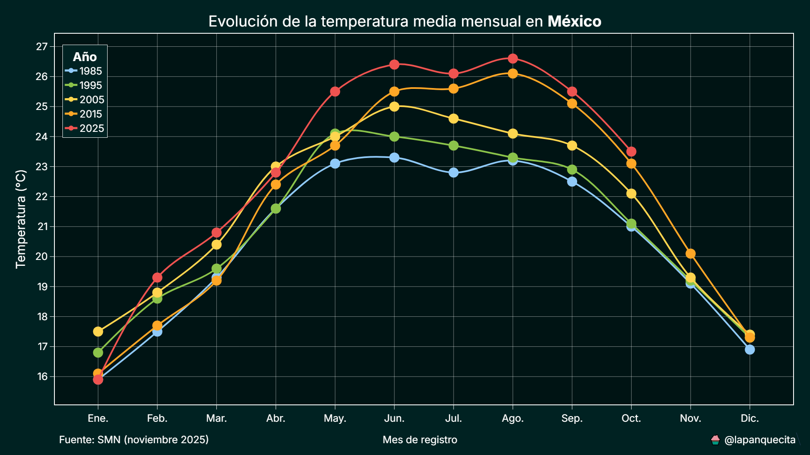
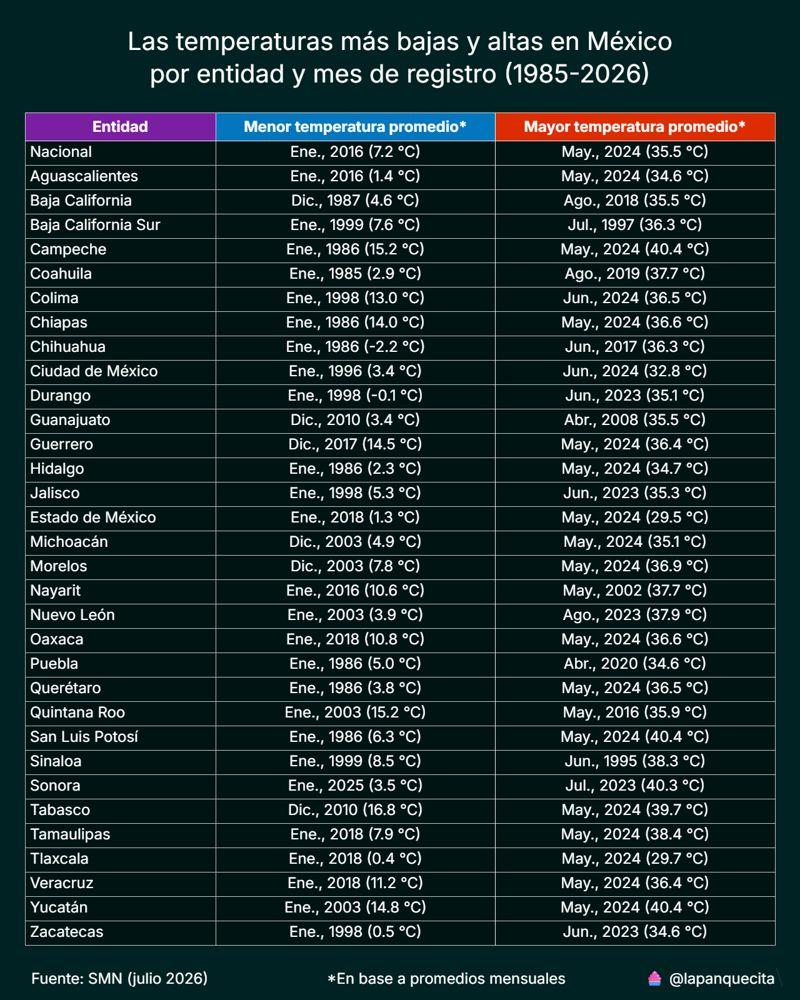
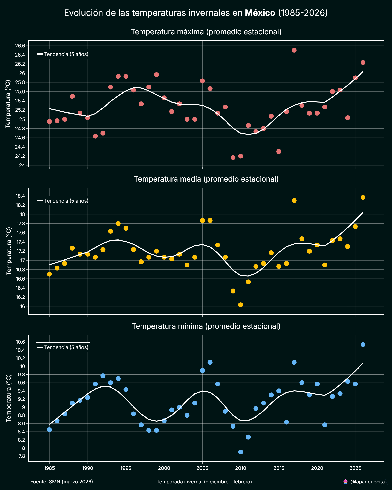
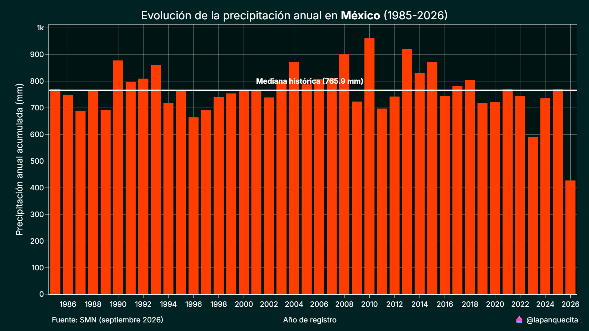
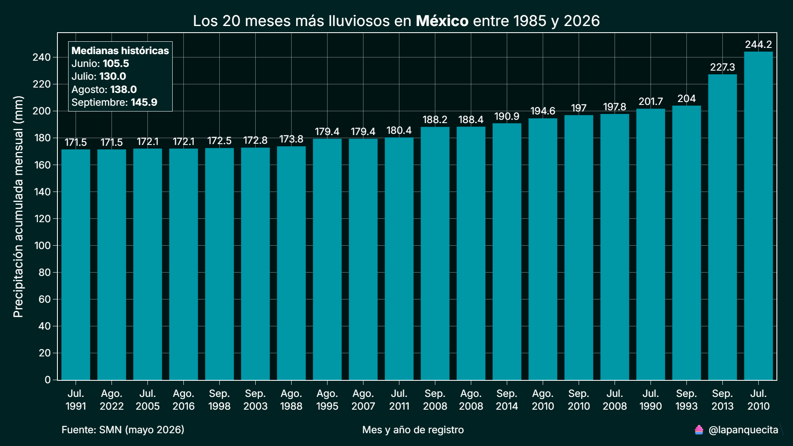

# Climatología en México

Este repositorio contiene herramientas para analizar las tendencias de temperatura y precipitación en México a lo largo de múltiples décadas.

Los datos provienen del Servicio Meteorológico Nacional (SMN), que los publica mensualmente a nivel estatal en formato PDF (de 1985 a 2025).

El propósito de este proyecto es convertir, limpiar y estructurar esos datos en un formato más accesible para su análisis y visualización.

Fuente de datos:
[Resúmenes mensuales de temperaturas y lluvias — SMN](https://smn.conagua.gob.mx/es/climatologia/temperaturas-y-lluvias/resumenes-mensuales-de-temperaturas-y-lluvias)

## Requisitos

Para ejecutar el proyecto completo se requieren los siguientes componentes:

* **Python 3.13 o superior**
* **Java** (necesario para la conversión de archivos PDF a CSV)
  Descarga oficial: [https://www.java.com/en/download/manual.jsp](https://www.java.com/en/download/manual.jsp)
* **Librerías de Python** listadas en el archivo `requirements.txt`

> Si solo se desea utilizar la base de datos procesada, basta con descargar el archivo `data.csv`.

## Contenido del repositorio

| Archivo            | Descripción                                                                                                                                                                           |
| ------------------ | ------------------------------------------------------------------------------------------------------------------------------------------------------------------------------------- |
| `etl.py`           | Script principal de extracción, transformación y carga (ETL). Descarga los archivos del SMN, los convierte a CSV y consolida la información en una base de datos de series de tiempo. |
| `script.py`        | Script para generar visualizaciones de temperatura y precipitación a partir de los datos procesados.                                                                                  |
| `data.csv`         | Base de datos consolidada con información histórica de temperatura y precipitación (1985–2025).                                                                                       |
| `requirements.txt` | Lista de dependencias necesarias para ejecutar los scripts del proyecto.                                                                                                              |

## Análisis y visualizaciones

El script `script.py` permite generar distintos tipos de análisis y visualizaciones, tanto a nivel nacional como estatal.
A continuación se presentan algunos ejemplos.

### Temperatura promedio

Muestra la temperatura promedio mensual (media, máxima o mínima), configurable por rango de años y entidad federativa.

También puede generarse a nivel nacional para observar tendencias generales del país.
Esta herramienta resulta útil para observar tendencias a lo largo del tiempo.

### Meses más fríos y cálidos

Tabla comparativa con los meses más fríos y más cálidos registrados en cada estado entre 1985 y 2025.

### Temperatura invernal

Visualización de la evolución del invierno meteorológico (diciembre, enero y febrero) para una entidad federativa específica.

La gráfica se compone de tres subgráficas que muestran la temperatura mínima, media y máxima registradas durante el periodo analizado.

Cada una incluye líneas de tendencia, lo que permite identificar cambios graduales en el comportamiento de la temperatura invernal a lo largo del tiempo.

### Precipitación anual acumulada

Visualización de la precipitación total anual, acompañada de una línea de referencia con la mediana histórica para proporcionar contexto.

Esta visualización puede generarse tanto a nivel nacional como por entidad federativa.

### Meses más lluviosos

Identifica los 20 meses con mayor precipitación en el periodo analizado, tanto a nivel nacional como estatal.
Incluye una tabla de referencia con las medianas históricas correspondientes a los meses de verano.

Al igual que las gráficas de temperatura, esta vista puede filtrarse a nivel nacional o estatal.

## Conclusión

Este proyecto tiene un enfoque exploratorio y educativo, y no pretende ser exhaustivo debido a las limitaciones de los datos disponibles.
Sin embargo, constituye una base sólida para el análisis de tendencias climáticas en México y puede ampliarse con nuevos tipos de visualizaciones o fuentes de información.

A futuro se planea incorporar más análisis y métricas relacionadas con el cambio climático y la variabilidad regional.